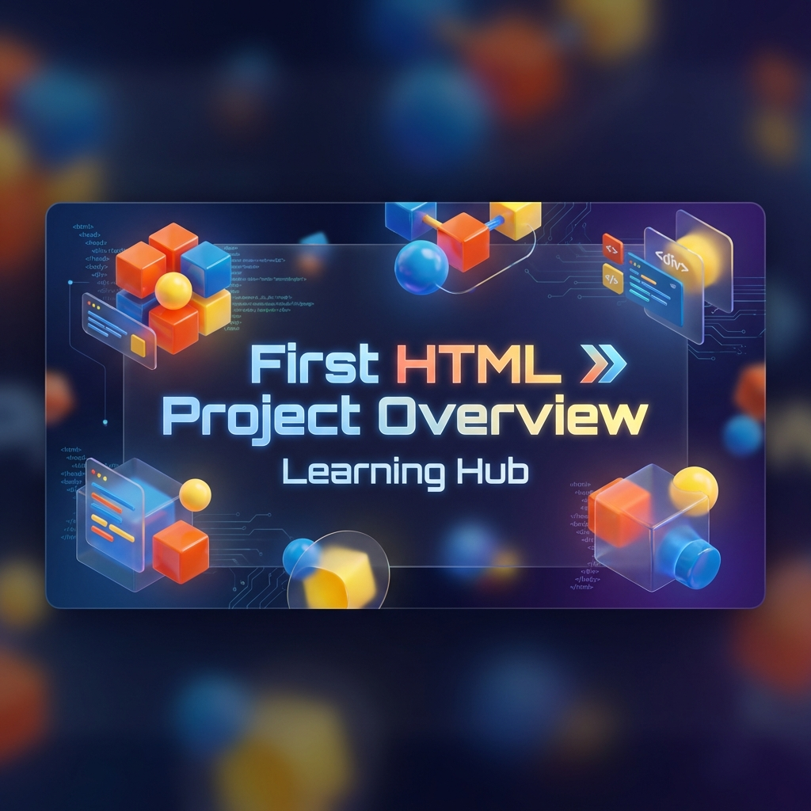

<h1 align="center">🌐 First HTML Project Overview - Learning Hub</h1>

<p align="center">
  
  
  
  
  
</p>

---

## 📖 Project Overview

This project is a comprehensive **HTML & CSS Learning Hub** designed to showcase web development concepts from the ground up. It features an interactive **Three.js powered 3D dashboard** that provides access to over 30 unique learning modules, each focusing on specific web technologies and techniques.

---

## 🚀 Live Demo

Experience the full interactive dashboard and all learning modules live on GitHub Pages.

[](https://ajaygangwar945.github.io/First-HTML-Project-Overview/)

---

## ✨ Key Features

- **💎 Glassmorphism UI**: Modern aesthetic with translucent cards, smooth gradients, and interactive hover states.
- **🌀 3D Backdrop**: Dynamic background animation using **Three.js**.
- **🔍 Intelligent Search**: Real-time filtering system to navigate through 30+ HTML topics instantly.
- **📱 Fluid Responsiveness**: Hand-crafted CSS media queries for desktop, tablet, and mobile.
- **🛡️ Security Audited**: Core forms and external scripts reviewed for security best practices.
- **🔝 Premium UX**: Functional "Go Top" button with smooth-scroll.

## 📂 Project Structure

```text
First-HTML-Project-Overview/
├── Audio/                  # Sound assets (hangouts_incoming_call.ogg)
├── Images/                 # UI assets, profile pics, and icons (27 total)
├── Video/                  # Sample media for video modules (sample.mp4)
├── index.html              # Main 3D Dashboard & Search Engine
├── index.css               # Essential dashboard styling
│
├── 📑 Foundations
│   ├── html.html           # Introduction to HTML
│   ├── html basics.html    # Fundamental tags & attributes
│   ├── basic html document structure.html
│   ├── anchor tag.html     # Hyperlinks and navigation
│   ├── image tag.html      # External media rendering
│   ├── table tag.html      # Data presentation
│   ├── form.html           # HTML Form foundations
│   ├── frame.html          # Iframe implementations
│   ├── color.html          # Color theory and Hex/RGB/RGBA
│   └── CSS.html            # Styling foundations and selector logic
│
├── 📑 Modern Standards (HTML5)
│   ├── html 5.html         # Semantic elements and new APIs
│   ├── html 5 form.html    # Modern validation & new input types
│   ├── svg.html            # Vector graphics implementation
│   ├── audio.html          # HTML5 Audio integration
│   ├── video.html          # HTML5 Video integration
│   ├── special tag.html    # Figure, Details, Summary, Meter
│   └── special symbol.html # HTML Entities and SVG Icon usage
│
├── 📑 UI Suite & Identity
│   ├── ajay.html           # Developer Profile Module
│   ├── website.html        # Multi-section portal showcase
│   ├── mobile website.html # Mobile-first fluid design sandbox
│   ├── registration.html   # Complex form architecture
│   ├── login.html          # Classic Authentication UI
│   ├── sign in.html        # Alternative Modern Auth UI
│   ├── awesome login form.html # Advanced CSS-focused Form
│   ├── accordian menu.html # Interactive collapsible navigation
│   └── image box.html      # Modern lightbox gallery component
│
├── 📑 Extras
│   ├── font awesome.html   # Icon library integration (v5)
│   ├── font awesome 6.html # Latest font awesome exploration
│   ├── free.html           # Creative sandbox
│   └── full screen.html    # Layout scaling techniques
│
└── 📑 Global Styles
    ├── website.css         # Main site architecture & layout
    ├── css.css             # Component styling library
    ├── accordian menu.css  # Logic-specific component styles
    ├── html basics.css     # Theming for foundations
    ├── basic html document structure.css
    ├── inside html basics.css
    ├── html 5.css          # Semantic UI standards
    ├── inside html 5.css
    ├── special tag.css     # Component styling for HTML5 tags
    └── awesome login form.css
```

## 🛠️ Technologies Used

- **HTML5**: Semi-semantic structure and modern APIs.
- **CSS3**: Variable-based theming, Flexbox, Grid, and Keyframe animations.
- **JavaScript**: Dashboard logic and Three.js integration.
- **Three.js**: WebGL-based 3D graphics.
- **Font Awesome**: Premium vector iconography.
- **Google Fonts**: Outfit & Inter Typography.

## 🚀 How to Get Started

1. **Clone the Project**:

   ```bash
   git clone https://github.com/ajaygangwar945/First-HTML-Project-Overview.git
   ```

2. **Launch**:
   Simply open `index.html` in any modern web browser to enter the hub.

---

<p align="center">
  <b>Designed & Developed by Ajay Gangwar</b><br>
  <i>Always learning, always building.</i>
</p>
